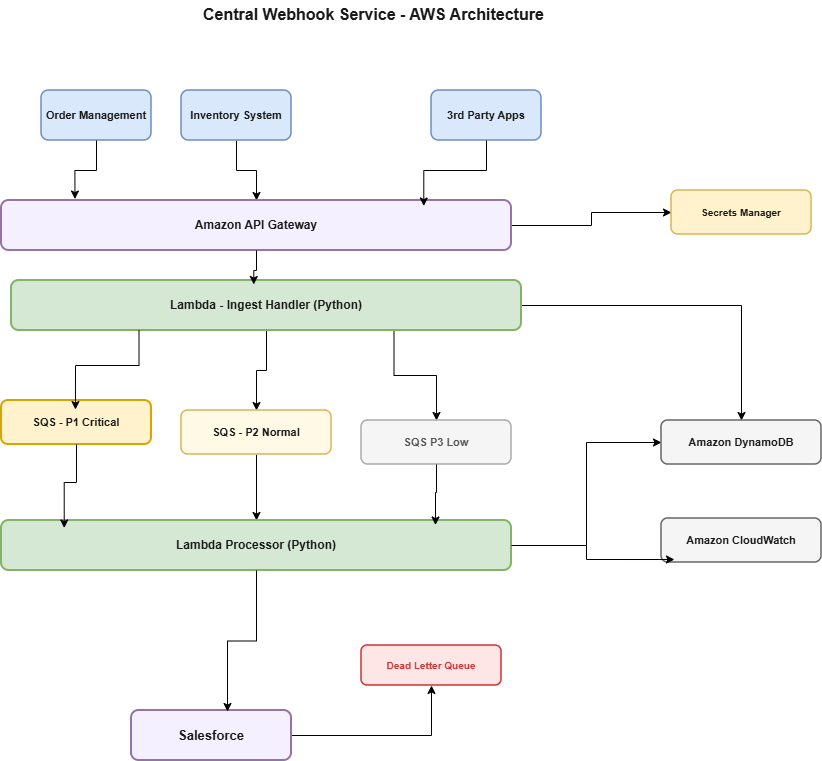

# Central Webhook Service

## Technical Design - Python + AWS

## The Problem

Multiple source systems (order management, inventory, third-party applications)
need to notify a downstream Salesforce system when data changes and should be processed according to message priorit.

Building direct integrations between each system would lead to tight coupling, increased maintenance overhead and complexity.

## Solution Overview

This solution implements a centralized webhook ingestion and delivery service
built on AWS using Python.

The service receives event notifications from multiple source systems (both
custom-built and off-the-shelf), classifies them based on priority, and enqueues
them for processing while maintaining ordering and priority guarantees.

Before delivery, the system transforms the incoming payload with additional data
(eg customer and product information) and then sends the final message to Salesforce.

The design treats the webhook service as a reusable integration capability rather
than a point-to-point connector. This allows new source or target systems to be
added by introducing adapters, without changing the core processing pipeline.

## Architecture



CloudWatch runs alongside everything. It will have structured logs, queue depth metrics,
delivery latency, etc.

Each source system is a consumer, which gets registered once after that it gets its own queue and API key. Adding a new source is a registration API call, not a
code change.

---

## System Flow

1. **Webhook Ingestion**
   Client systems send events to Amazon API Gateway.

2. **Request Handling**
   The request is processed by AWS Lambda (Ingest Service):
   - Input validation
   - Message ID generation
   - Idempotency check

3. **Queueing (Priority-Based)**
   Messages are routed to Amazon SQS FIFO queues:
   - P1 - High priority
   - P2 - Medium priority
   - P3 - Low priority

4. **Processing**
   A worker (Lambda) processes messages using:
   - Priority-first polling (P1 then P2 then P3)
   - FIFO ordering within each queue

5. **Data Enrichment**
   Additional data (customer, product) is fetched before delivery.

6. **Delivery**
   The enriched payload is sent to Salesforce.

7. **Failure Handling**
   Failed messages are retried with exponential backoff and eventually moved to a Dead Letter Queue (DLQ).

---

## Tech Stack

- Python
- Amazon API Gateway
- AWS Lambda
- Amazon SQS (FIFO queues)
- Amazon DynamoDB (idempotency + audit)
- Amazon CloudWatch (logs + metrics)
- Docker (local development)

---

## Trade-offs

### Priority vs Global Ordering

Prioritization improves responsiveness but breaks global ordering across all messages.

### Enrich at delivery, not ingest

Data is fetched from upstream systems just before sending to Salesforce,
not when the message first arrives. This means Salesforce always gets
current data even if a message sat in the queue for several minutes.

### One enrichment engine, pluggable adapters

Rather than separate enrichment services per object type, one engine
routes by object_type to the right adapter. Adding a new source system
means one new adapter class, the core pipeline is unchanged.

---

## Scaling

**Lambda concurrency** - handles horizontal scale automatically. SQS triggers
multiple Lambda instances under load.

**Async enrichment** - within each Lambda invocation. asyncio.gather runs
upstream API calls in parallel. For a sales order that needs two API calls
at 150ms each, serial would take 300ms. Parallel takes 150ms.

## Reliability

**Idempotency** - Each request includes an message_id key stored in DynamoDB to prevent duplicate processing.

**Retry with backoff** - for Salesforce delivery failures are handled using exponential backoff.

## Security

**API key per consumer** - each registered consumer gets a unique key stored
in DynamoDB. API Gateway validates it on every request.

**Input validation** = API Gateway enforces the OpenAPI schema before the
request reaches Lambda.

**PII handling** - message payloads are not logged. CloudWatch logs contain
only structural metadata: message_id, consumer_id, event_type,
priority, latency_ms. No customer names, no order contents.

## Observability

Every log line is structured JSON with the same fields:

```json
{
  "timestamp": "2026-04-02T10:30:01Z",
  "level": "INFO",
  "service": "injest-handler",
  "message_id": "msg_abc",
  "consumer_id": "order-mgmt",
  "correlation_id": "corr_123",
  "event_type": "order.status_changed",
  "priority": 1,
  "stage": "delivery_success",
  "latency_ms": 142
}
```

correlation_id is injected at API Gateway and flows through every log
line for the same request. We can trace a message from ingest to delivery
in CloudWatch Logs Insights with a single query.

## Local setup

See [README.md](README.md) for setup and run instructions.

API schema: [openapi.yaml](openapi.yaml)
